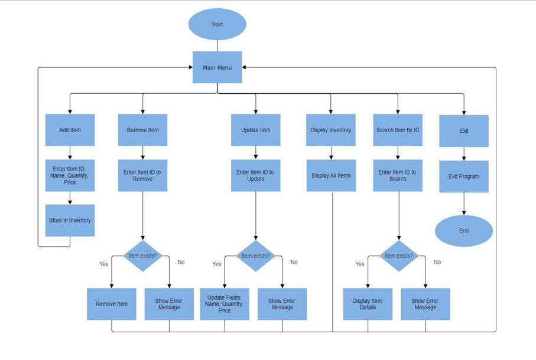

# 📦 Inventory Management System (C++)

This Inventory Management System is a custom-built C++ project that allows efficient inventory tracking using **Linked Lists** and a **custom Hash Map** implementation. Designed as part of a DSA (Data Structures and Algorithms) course, this project showcases practical use of core data structures, file handling, and object-oriented design in a real-world scenario.

---

## 📌 Overview

This system supports complete **CRUD operations** (Create, Read, Update, Delete) on inventory items while ensuring fast access and storage through hashing and dynamic memory allocation. It is built without relying on STL containers for learning purposes and to demonstrate how such systems function under the hood.

---

## 🎯 Objectives

- Efficiently manage inventory items using custom data structures
- Perform fast ID-based lookups using a custom Hash Map
- Dynamically store items in memory using a Linked List
- Persist inventory data using file I/O
- Practice object-oriented design patterns and algorithm implementation

---

## ✅ Features

- ➕ **Add Item** – Insert a new item with unique ID, name, quantity, and price
- ❌ **Remove Item** – Delete an item by ID
- ✏️ **Update Item** – Modify existing item details
- 🔍 **Search Item** – Quickly find items using ID via hash map
- 📋 **Display All Items** – Traverse the inventory list and show all records
- 💾 **Save to File** – Write all current inventory to a text file
- 📂 **Load from File** – Read inventory data from a file at program start

---

## 🧱 Code Structure

| File                | Purpose                                      |
|---------------------|----------------------------------------------|
| `main.cpp`          | Runs the menu and connects all functionalities |
| `Item.h/cpp`        | Defines inventory item attributes and methods |
| `Inventory.h/cpp`   | Contains logic for adding, removing, and displaying items |
| `HashMap.h/cpp`     | Implements custom hash map for fast ID lookups |
| `FileHandler.cpp`   | Manages file reading and writing              |

---

## 🧮 Data Structures Used

### 🔗 Linked List
- Used for sequential storage and traversal of items
- Enables dynamic memory allocation
- Supports append, delete, and traverse operations

### #️⃣ Hash Map
- Maps item IDs to their node locations in the linked list
- Custom implementation using **chaining**
- Average **O(1)** complexity for insert, search, and delete

---

## 📊 System Workflow

> 🖼️ Below is the visual representation of how the system works:

---

## 🧠 Learning Outcomes

- ✅ Designed and implemented a real-world inventory system from scratch  
- ✅ Mastered **Linked Lists** and **Hash Maps** without relying on STL  
- ✅ Learned about **memory management**, **hashing**, and **chaining techniques**  
- ✅ Improved understanding of **object-oriented programming** and **file handling** in C++

---

